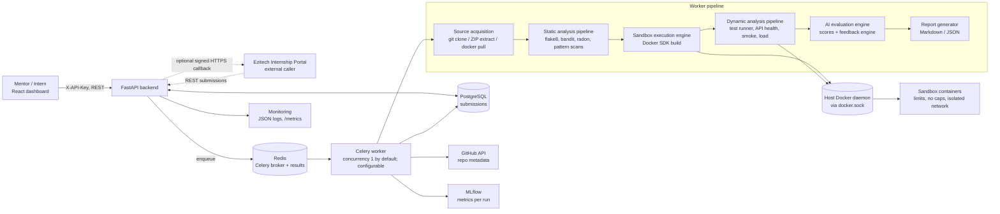
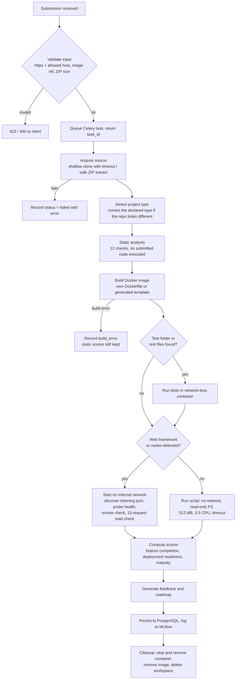

# Architecture and Sandbox Execution Workflow

## Component architecture

## Sandbox execution workflow

Cleanup runs in a `finally` block, so the environment is destroyed even when a step fails. If the
evaluation engine itself crashes, the task still records a `failed` submission with the error.

## Sandbox isolation

| Control | Value |
|---|---|
| Memory | 512 MB, swap disabled |
| CPU | 0.5 CPU |
| Processes | 256 PIDs (blocks fork bombs) |
| Capabilities | all dropped, `no-new-privileges` |
| Network (web apps) | internal Docker network without internet, reachable only from the worker |
| Network (scripts, tests) | disabled (tests get network once only to install `pytest`, flagged in the result) |
| Filesystem | read-only for script runs, `/tmp` as tmpfs |
| Time | 120 s execution, 60 s tests |

## Scoring

Each category is a 0-100 score, or N/A when it does not apply (for example authentication for a
non-web script). **Engineering maturity** is the average of the applicable component scores. When fewer
than 5 components are available (Docker-image submissions, which have no source), the value is flagged
`partial` and excluded from ranking.
